# 🐾 Moscow Zoo helper bot — Telegram-бот Московского зоопарка

Этот Telegram-бот помогает пользователям узнать своё тотемное животное, пройти викторину, оставить отзыв и узнать больше о программе опеки животных в Московском зоопарке.

## 🚀 Возможности

- 🐾 Викторина с тотемными животными
- 📊 Подсчёт очков и определение результата
- 📩 Отправка результатов на email сотрудникам
- 🌐 Переход на сайт зоопарка
- 💬 Отправка отзывов
- ℹ️ Информация о зоопарке

---

## 🛠 Установка

1. Клонируй репозиторий:

```bash
git clone https://github.com/your-username/zoo-totem-bot.git
cd zoo-totem-bot
```
2. Далее необходимо проверить установку всех необходимых зависимостей
3. Создай `.env` файл или отредактируй `config.py` и добавь туда свои данные:
```python
BOT_TOKEN = "ТВОЙ_BOT_TOKEN"
SMTP_SERVER = "smtp.gmail.com"
SMTP_PORT = 587
SENDER_EMAIL = "твоя_почта@gmail.com"
SENDER_PASSWORD = "пароль_или_пароль_приложения"
RECEIVER_EMAIL = "куда_отправлять_результаты@mail.ru"
```
3. Запуск бота:
```pyhon
python bot.py
```
## 📁 Структура проекта
```bash
handlers/
│
├── start.py             # Приветствие и /start
├── quiz.py              # Логика викторины
├── feedback.py          # Сбор отзывов
├── result.py            # Повторный вызов результата
│
keyboards/
├── inline.py            # Кнопки
│
data/
├── quiz_data.py         # Вопросы викторины
├── animals_data.py      # Профили животных
│
utils/
├── scoring.py           # Подсчёт очков
│
images/
├── *.jpg                # Фото животных и preview.jpg
│
bot.py                   # Точка входа
config.py                # Настройки токена и SMTP
logging_config.py        # Логгирование

```
## 📝 Отзывы
Отзывы сохраняются в `feedback.txt`, с указанием `ID` пользователя и его имени.
## 📬 Email уведомления
Бот отправляет письмо на указанный `email` после прохождения викторины, если пользователь выбирает опцию "Связаться с сотрудником"
## 📸 Изображения
Фотографии животных должны находиться в папке `images/` и называться по имени животного (например: `аксолотль.jpg`, `пингвин.jpg` и т.д.).
## ✅ Зависимости
- `aiogram`
- `python-dotenv` (если используешь .env)
- `smtplib`, `email` (встроенные модули)
## 🚀 Масштабирование
Для добавления новго животного нужно добавить его фото в `images/`, также внести его данные в `quiz_data.py` (при этом можно создать новый вопрос или просто внести животное в уже существующий) и внести его профиль в `animals_data.py`

Пример данных:
`quiz_data.py`
```python
{
        "question": "Какой отдых тебе по душе?",
        "options": [
            "Ванна, свечи, лягушачьи звуки — идеально 🛁",
            "Болтать с друзьями на пальме 🌴",
            "Парить над землёй и думать о вечном 🦅",
            "Полежать на скале и притвориться статуей 🪨"
        ],
        "scores": [
            {
                "аксолотль": 2,
                "капибара": 2,
                "бегемот": 1,
                "пингвин": 2
            },
            {
                "александрийский попугай": 2,
                "фенек": 1,
                "капибара": 1
            },
            {
                "белоголовый орлан": 2,
                "леопард": 1,
                "белоголовый сип": 2
            },
            {
                "гималайский медведь": 2,
                "дикдик": 1,
                "кустарниковая собака": 1
            }
        ]
    }
```
`animals_data.py`

```python
 "аксолотль": {
        "desc": "Милый и загадочный аксолотль — существо, которое словно сошло с другой планеты. Всегда улыбается и не стареет! 🧪",
        "care_info": "Ты можешь стать опекуном аксолотля и помогать сохранять редкий вид амфибий."
    }
```
## ℹ️ Пример работы:
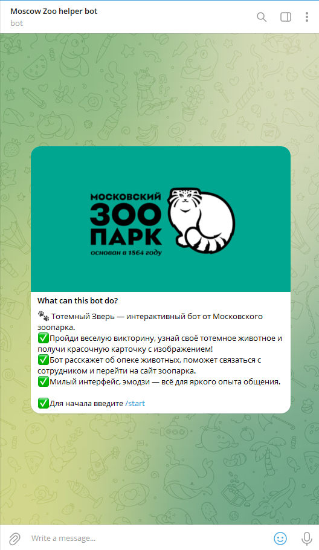
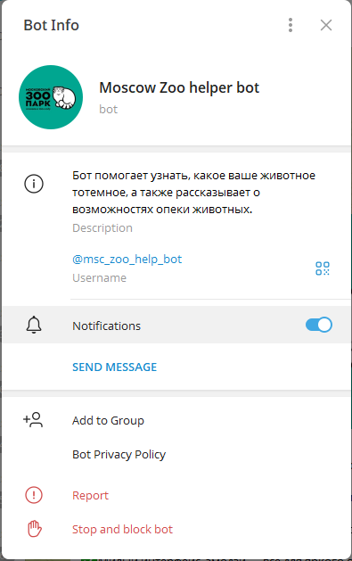
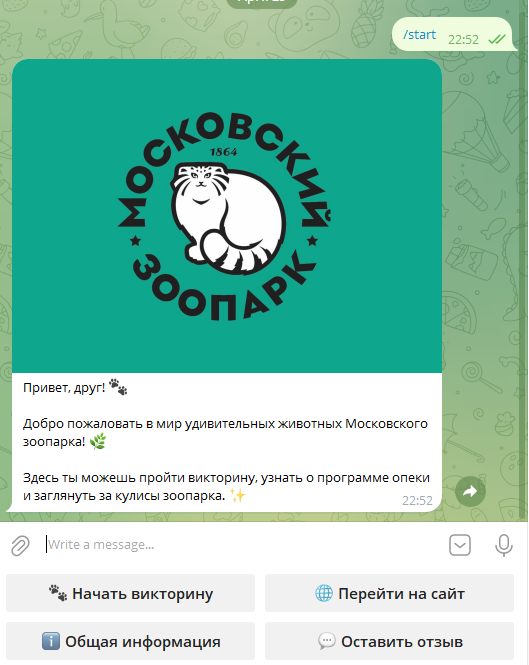
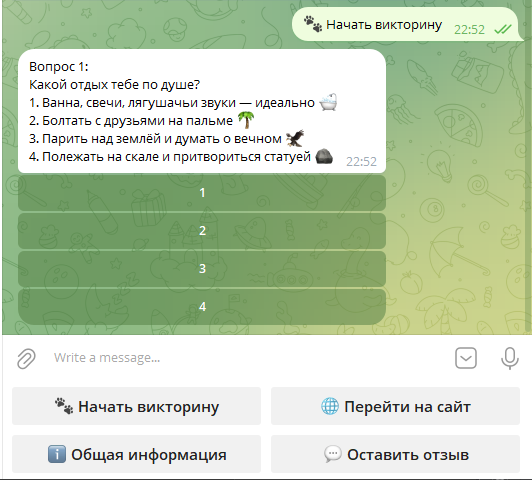
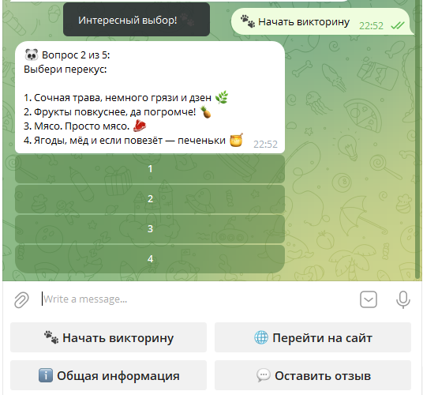
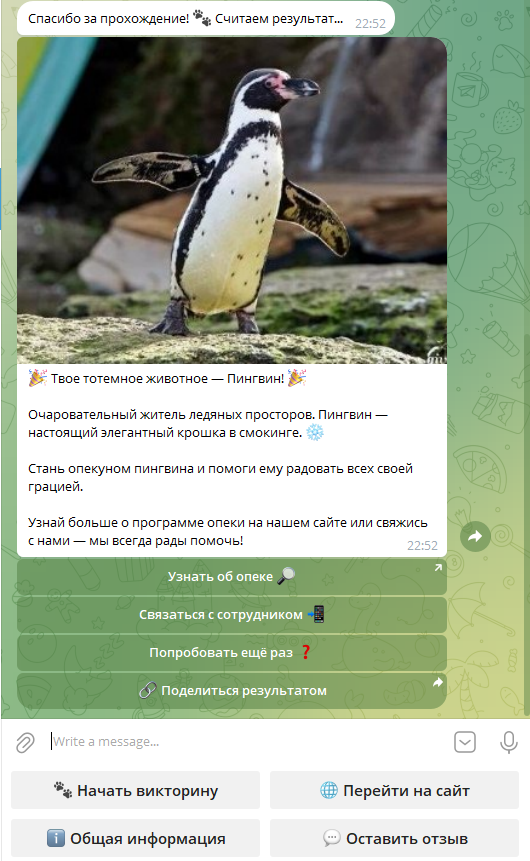
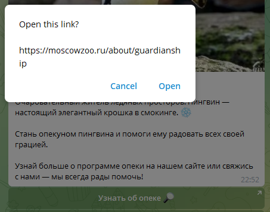
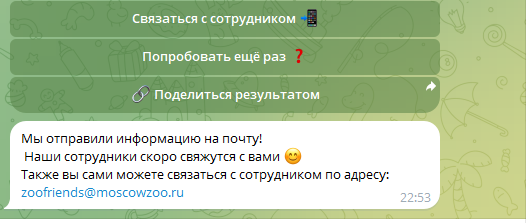
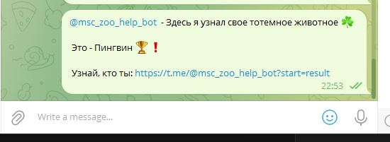
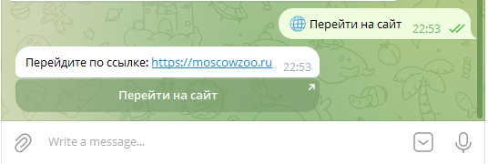
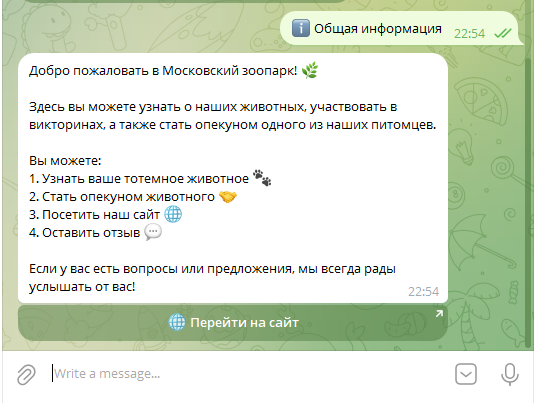
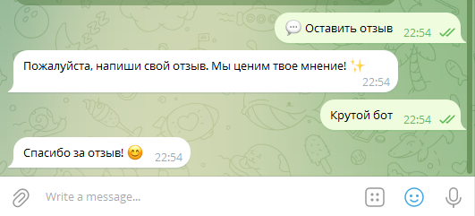